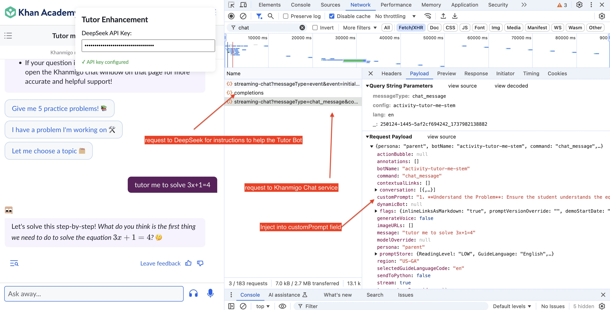

# Tutor Enhancement Extension

A Chrome extension that enhances tutoring interactions by intercepting and augmenting tutoring requests with additional pedagogical guidance using the DeepSeek API.


## How It Works

- Intercepts tutoring requests to Khan Academy's AI system
- Fetches guidance from DeepSeek API
- Injects guidance into tutoring requests (the "customPrompt" field)



## Results

- **Does not achieve the goal** of making the Tutor Bot more helpful:
  - The Tutor Bot does not seem to use the customPrompt field
  - The team at Khan Academy must set the output token to be low. This is understandable from cost management perspective, but unfortunately it makes the Tutor Bot less effective.
- **Useful as a proof of concept** for intercepting and augmenting API requests.


## Project Structure

```
.
├── core/
│   ├── configValidator.js     # Configuration validation
│   ├── eventBus.js           # Event management system
│   └── requestManager.js      # Request handling and interception
├── utils/
│   ├── debugger.js           # Debugging utilities
│   └── interceptors/
│       └── base.js           # Base interceptor class
├── popup/
│   └── popup.js              # Extension popup interface
├── config.js                 # Global configuration
├── contentLoader.js          # Content script loader
└── solutionInjector.js       # Main injection logic
```

## Setup

1. Install the extension in Chrome developer mode
2. Configure your DeepSeek API key in the extension popup
3. Navigate to Khan Academy tutoring interface

## Configuration

The extension requires:

- DeepSeek API key (configured via popup)
- Khan Academy API endpoints (pre-configured)

Default settings in `config.js`:

- Socratic questioning mode
- Error prevention features
- Interactive checks
- Debug mode toggle

## Core Components

### SolutionInjector

- Intercepts and processes tutoring requests
- Manages API interactions with DeepSeek
- Handles request/response lifecycle

### DeepseekInterceptor

- Manages DeepSeek API interactions
- Processes pedagogical enhancements
- Handles API authentication

### TutorDebugger

- Logging system for debugging
- Tracks interaction history
- Enables/disables debug output

## API Integration

The extension integrates with:

1. Khan Academy's internal AI API
2. DeepSeek's completion API

API endpoints are configured in `config.js`.

## Development

### Installation

1. Clone the repository
2. Load unpacked extension in Chrome
3. Configure API keys

### Building

No build process required - loaded directly as unpacked extension.

### Testing

Manual testing through Chrome extension interface.

## Security Notes

- API keys are stored in Chrome's local storage
- All requests use HTTPS
- Sensitive data is logged only in debug mode

## Limitations

- Works only on Khan Academy domains
- Requires DeepSeek API access
- Chrome-only compatibility
